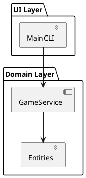

# アーキテクチャ図 PlantUML 記法ルール

物理構造（COMP/UNIT/DEP）を可視化する際は、以下の記法を使用してください。

## 1. 基本宣言
- **開始/終了**: `@startuml` 〜 `@enduml`
- **配置**: デフォルト（上から下）を使用。

## 2. 要素の定義
- **コンポーネント (COMP)**: `[コンポーネント名] as comp_id` または `component "名" as id`
  - 論理的な塊、ディレクトリ階層、サブシステム。
- **ユニット (UNIT)**: `artifact "ファイル名" as unit_id` または `file "名" as id`
  - 実際のソースコードファイル、モジュール。
- **パッケージ (Layer)**: `package "レイヤー名" { ... }`
  - 物理的なレイヤー（UI, Domain, Infra 等）を区切る場合に使用。

## 3. 依存関係 (DEP)
- **依存**: `-->`
  - `comp_a --> comp_b` : コンポーネント間依存。
  - `unit_a --> unit_b` : ユニット間依存。
- **注釈**: `note right of id : 理由`

## 4. 厳格な階層ルール
- 矢印は同一階層（COMP間、または同一COMP内のUNIT間）でのみ引くこと。
- 階層を跨ぐ（COMPから特定の内部UNITへの）直接的な矢印は原則禁止。

## サンプル

