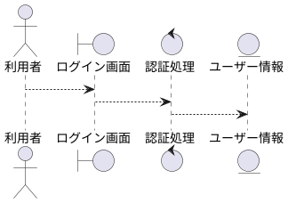

# ロバストネス図 PlantUML 記法ルール

ロバストネス図を作成する際は、以下の PlantUML 標準構文を使用してください。

## 1. 基本宣言
- **開始/終了**: `@startuml` 〜 `@enduml`
- **配置**: デフォルト（上から下）を使用。

## 2. 要素の定義
- **アクター (Actor)**: `actor "アクター名" as actor_id`
  - 外部のユーザーやシステム。
- **境界 (Boundary)**: `boundary "画面/API名" as boundary_id`
  - システムの境界、ユーザーインターフェース。
- **制御 (Control)**: `control "ロジック名" as control_id`
  - 処理、計算、バリデーション。
- **エンティティ (Entity)**: `entity "データ名" as entity_id`
  - 永続化されるデータ、状態。

## 3. 接続 (Connectors)
- **単方向矢印**: `-->`
- **双方向矢印**: `<-->` (必要な場合のみ)

## 4. グルーピング (Optional)
- **パッケージ**: `package "機能グループ名" { ... }`
  - 関連する要素を視覚的にまとめたい場合に使用。

## サンプル

