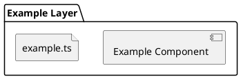

# 物理構造定義書 (System Architecture)

## 設計方針 (Architecture Policy)
システムの構成を決定した際の核心的な指針を記述します。

- **コア原則**: [例: クリーンアーキテクチャの3層構造（Presentation, Domain, Infrastructure）を基本とする。]
- **分離レベル**: [例: 変更の可能性が高いI/O（DB, CLI）を、ビジネスロジックからDIPにより完全に分離。]
- **プロジェクト特有の判断**: [例: 小規模なCLIツールのための、シンプルなレイヤー構成を採用。]

## アーキテクチャ構成図 (Configuration Diagram)
システムの物理的な階層構造とユニット間の依存関係を可視化します。

## ユニット集約セクション (Units)
論理的な機能（FUNC）やデータ（DATA）を、物理的なソースコード単位（UNIT）にまとめます。

| ID | ユニット名 | 役割・責務 | 物理パス |
| :--- | :--- | :--- | :--- |
| UNIT-XXX | [ファイル名等] | [このユニットが担う物理的な役割] | `src/...` |

## コンポーネント構造セクション (Components)
ユニットをディレクトリやサブシステムという大きな塊（COMP）に整理します。

| ID | コンポーネント名 | 概要 | 包含するユニットID | 物理パス |
| :--- | :--- | :--- | :--- | :--- |
| COMP-XXX | [モジュール名] | [物理的な階層構造としての定義] | UNIT-AAA, UNIT-BBB | `src/module/` |

## 依存関係セクション (Dependencies)
ユニット間、およびコンポーネント間の物理的な依存関係を定義します。
※実装後はスクリプトにより自動抽出・更新されることを主とします。

| ID | 種別 | ソース (From) | ターゲット (To) | 理由・性質 |
| :--- | :--- | :--- | :--- | :--- |
| DEP-XXX | UNIT間 / COMP間 | [ID] | [ID] | [静的依存 / 動的依存 等] |

## 変更履歴
| 日付 | 内容 | 理由 |
| :--- | :--- | :--- |
| 202X-MM-DD | 新規作成 | 初版定義 |
