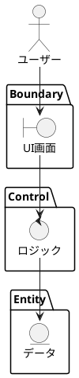

# [REQ-XXX] 要求タイトル

## 1. 要求概要 (Overview)
この要求が解決しようとしている課題、背景、および達成したいゴールを記述します。

## 2. ロバストネス分析 (Robustness Analysis)
要求を実現するための論理的な相互作用を可視化します。

## 3. 詳細要件 (Specifications)
### [SPEC-XXX-YYY] 要件名
- **内容**: 
- **優先度**: 高/中/低
- **状態**: 未着手/定義済み/実装中/完了

## 4. 論理データ定義 (Data Entities)
ロバストネス図の Entity に対応します。

### [DATA-XXX-ZZZ] データ名
- **構造**: 
- **制約**: 

## 5. 機能設計 (Function Decomposition)
ロバストネス図の Control に対応します。

### [FUNC-XXX-YYY-ZZZ] 機能名
- **Input**: 
- **Logic**: 
- **Output**: 
- **Exception**: 

## 6. 変更履歴
| 日付 | 内容 | 理由 |
| :--- | :--- | :--- |
| 202X-MM-DD | 新規作成 | 初版定義 |
