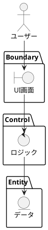

## ロバストネス分析 (Robustness Analysis)
要求を実現するための論理的な相互作用を可視化します。

```plantuml
@startuml
actor "ユーザー" as user

package "Boundary" {
  boundary "UI画面" as ui
}

package "Control" {
  control "ロジック" as logic
}

package "Entity" {
  entity "データ" as data
}

user --> ui
ui --> logic
logic --> data
@enduml
```
